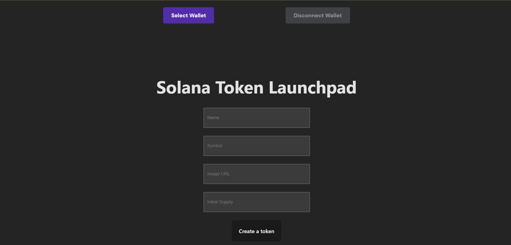

# Solana Token Launchpad

A simple, user-friendly interface for creating custom SPL tokens on the Solana blockchain. This React-based dApp lets anyone create their own tokens with just a few clicks, no coding required.



## Features

- 🪙 Create new SPL tokens in seconds
- ⚡ Connect with any Solana wallet (Phantom, Solflare, etc.)
- 🔒 Full control as token authority
- 🎨 Customize token name, symbol, and image
- 🔢 Configure initial supply and decimals
- 💸 Low-cost token creation (only standard Solana transaction fees)

## Live Demo

Try the live demo at [https://solanalaunchpad-pi.vercel.app](https://solanalaunchpad-pi.vercel.app)

## Getting Started

### Prerequisites

- Node.js (v14+)
- Yarn or npm
- A Solana wallet (Phantom, Solflare, etc.)

### Installation

1. Clone the repository:
   ```bash
   git clone https://github.com/yourusername/solana-token-launchpad.git
   cd solana-token-launchpad
   ```

2. Install dependencies:
   ```bash
   npm install
   # or
   yarn install
   ```

3. Start the development server:
   ```bash
   npm run dev
   # or
   yarn dev
   ```

4. Open [http://localhost:3000](http://localhost:3000) in your browser.

### Usage

1. Connect your wallet using the "Connect Wallet" button
2. Fill in your token details:
   - Name: Your token's full name
   - Symbol: A short ticker (typically 2-6 characters)
   - Image URL: A link to your token's logo image (optional)
   - Initial Supply: Amount of tokens to mint initially (optional)
3. Click "Create a token" and approve the transaction in your wallet
4. Your new token's mint address will be displayed after successful creation

## Technical Details

This project uses:
- React for the frontend interface
- Solana Web3.js for blockchain interactions
- SPL Token program for token creation
- Wallet Adapter for wallet connectivity

The token creation process:
1. Generates a new keypair for the mint account
2. Creates a transaction to initialize the mint account
3. Sets the connected wallet as both the mint authority and freeze authority
4. Signs and sends the transaction to the Solana network

## Limitations

- Currently only supports creating tokens with 9 decimals
- No support for creating metadata yet (coming soon)
- Initial token supply must be created separately by minting tokens after creation

## Future Enhancements

- [ ] Add metadata creation (name, symbol, image on-chain)
- [ ] Support for custom decimals
- [ ] Mint initial supply automatically
- [ ] Token verification and listing guide
- [ ] Add support for NFT creation
- [ ] Dark mode support

## License

This project is licensed under the MIT License - see the [LICENSE](LICENSE) file for details.

## Contributing

Contributions are welcome! Please feel free to submit a Pull Request.

1. Fork the repository
2. Create your feature branch (`git checkout -b feature/amazing-feature`)
3. Commit your changes (`git commit -m 'Add some amazing feature'`)
4. Push to the branch (`git push origin feature/amazing-feature`)
5. Open a Pull Request

## Acknowledgements

- [Solana](https://solana.com/) - The fastest blockchain in the world
- [Solana Web3.js](https://github.com/solana-labs/solana-web3.js) - JavaScript API for Solana
- [SPL Token Program](https://spl.solana.com/token) - Solana Program Library Token
